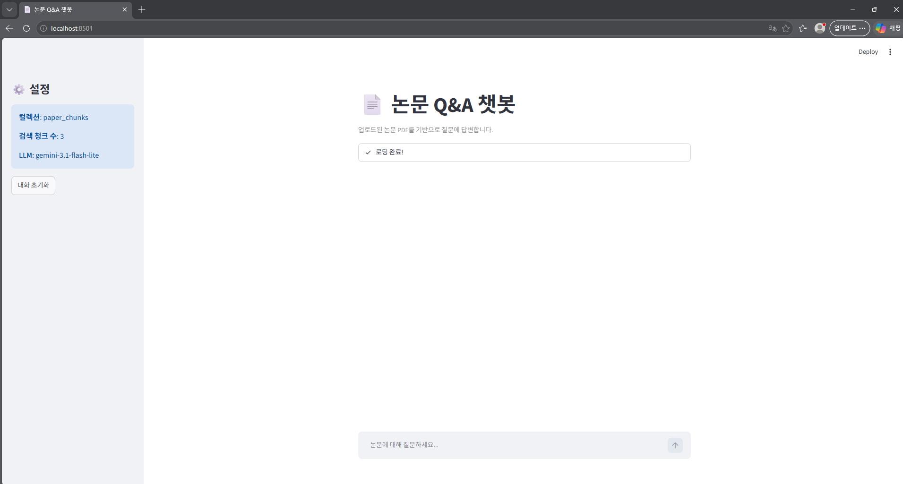
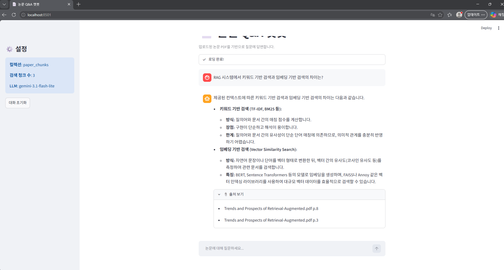
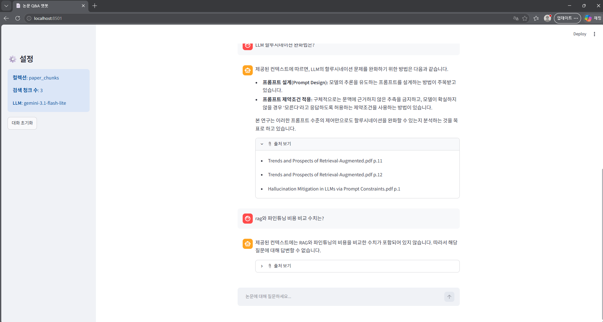
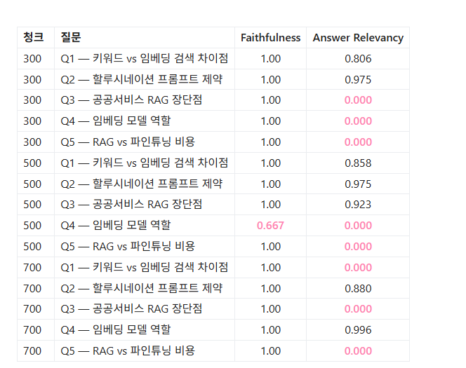

# 논문 PDF Q&A 챗봇

> 한국어 학술 논문 PDF를 벡터 DB에 저장하고, 자연어 질문으로 내용을 검색·답변하는 RAG 시스템


---

## 프로젝트 소개

공공 AI 사업 제안서를 검토하다 RAG 구조가 반복적으로 등장하는 것을 보고, 개념만 아는 상태에서 직접 구현해봐야 실제로 이해할 수 있겠다고 판단해 시작한 프로젝트입니다.

RAG(Retrieval-Augmented Generation)의 전체 파이프라인을 **외부 유료 서비스 없이** 직접 구현했습니다.

- **무료 스택만 사용**: OpenAI API 미사용. 임베딩은 로컬 모델, LLM은 Gemini 무료 티어
- **한국어 특화**: 한국어 논문 임베딩에 최적화된 `ko-sroberta-multitask` 사용
- **실험 기반 설계**: 청크 크기(300 / 500 / 700자)를 직접 비교 실험 후 최적값 선정
- **정량 평가 포함**: RAGAS로 Faithfulness · Answer Relevancy 측정 및 한계 분석

---

## 데모

### Streamlit 채팅 화면





> 논문 PDF를 업로드하면 자연어로 내용을 검색하고 출처(파일명·페이지)와 함께 답변을 확인할 수 있습니다.

### 청킹 비교 실험 결과



> 300 / 500 / 700자 청크 크기별 답변 품질 비교. 500자 기준이 전반적으로 가장 균형 잡힌 성능을 보였습니다.

---

## 시스템 아키텍처

```
[진입점]          [공통 모듈]           [외부 서비스]
ingest.py  ──┐
             ├── embeddings.py ─── ko-sroberta (로컬)
query.py   ──┘   db.py         ─── ChromaDB (로컬)
app.py           config.py
                                   Gemini 2.5 Flash (API)
```

### ingest 파이프라인

```
[data/*.pdf]
    ↓ PyMuPDF
[페이지별 텍스트 + 페이지번호]
    ↓ RecursiveCharacterTextSplitter (500자, overlap 50자)
[청크 리스트]
    ↓ ko-sroberta (768차원, 로컬 실행)
[벡터 + metadata {source, page}]
    ↓ ChromaDB.upsert()
[chroma_db/ 로컬 영구 저장]
```

### query 파이프라인

```
[사용자 질문]
    ↓ ko-sroberta (ingest와 동일 모델)
[질문 벡터]
    ↓ ChromaDB.query(top-3)
[관련 청크 + 출처(파일명·페이지)]
    ↓ PromptTemplate
[컨텍스트 + 질문]
    ↓ Gemini 2.5 Flash
[답변 + 출처 표시]
```

---

## 기술 스택

| 분류 | 라이브러리 | 비고 |
|------|-----------|------|
| PDF 파싱 | PyMuPDF | 페이지 번호를 metadata로 추출 |
| 청킹 | LangChain RecursiveCharacterTextSplitter | 문장 경계 우선 분할 |
| 임베딩 | jhgan/ko-sroberta-multitask | 한국어 특화, 로컬 실행 (무료) |
| 벡터 DB | ChromaDB | 로컬 영구 저장, 별도 서버 불필요 |
| LLM | Gemini 2.5 Flash | 무료 티어, 카드 등록 불필요 |
| UI | Streamlit | 채팅 인터페이스 |
| 평가 | RAGAS | 검색 품질 정량 평가 |

---

## 주요 설계 결정

### 공통 모듈 분리 (`embeddings.py` / `db.py`)

`ingest.py`와 `query.py`가 임베딩 모델과 ChromaDB 연결을 각자 들고 있으면, 모델명 변경 시 두 파일을 동시에 수정해야 하고 불일치 버그가 생깁니다. 공통 모듈로 분리해 **단일 책임 원칙**을 유지했습니다.

### `upsert()` 사용

`collection.add()` 대신 `collection.upsert()`를 사용해 동일 PDF를 재실행해도 중복 저장이 발생하지 않도록 했습니다.

### ChromaDB `embedding_function` 제거

초기 설계에서는 `embedding_function`을 ChromaDB에 넘겼으나, ChromaDB가 LangChain 임베딩 객체의 `.name()` 메서드를 요구해 충돌 발생. 임베딩은 `ingest.py` / `query.py`에서 직접 계산해 전달하는 방식으로 전환했습니다.

---

## 실험 결과

### 청킹 전략 비교 (300 / 500 / 700자)

동일 논문 5개, 동일 질문 5개로 청크 크기별 답변 품질을 비교했습니다.

| 질문 | 300자 | 500자 | 700자 | 비고 |
|------|:-----:|:-----:|:-----:|------|
| Q1 — 키워드 vs 임베딩 검색 차이점 | 4 | **5** | 2 | 700자는 핵심 문장이 주변 내용에 묻힘 |
| Q2 — 할루시네이션 프롬프트 제약 | **5** | 4 | 4 | 300자가 수치(12.20%→4.36%)까지 포착 |
| Q3 — 공공서비스 RAG 장단점 | 1 | 2 | 1 | 논문에 해당 내용 없음 (정상 동작) |
| Q4 — 임베딩 모델 역할 | 1 | 2 | **4** | 긴 설명은 큰 청크에서만 포착됨 |
| Q5 — 비용 비교 (할루시네이션 체크) | 5 | 5 | 5 | 전 크기 "없다"고 정확히 답변 |

**결론**: 500자가 전반적으로 가장 균형 잡힌 성능. 청크가 클수록 Signal-to-Noise Ratio 저하 → LLM의 구조화된 답변 생성이 어려워짐.

### RAGAS 정량 평가

| 청크 크기 | Faithfulness | Answer Relevancy (유효 평균) | 유효 행 수 |
|---------|:------------:|:---------------------------:|:--------:|
| 300자 | 1.00 | 0.891 | 2 / 5 |
| 500자 | 0.933 | **0.919** | 3 / 5 |
| 700자 | 1.00 | 0.938 | 2 / 5 |

> **평가 한계 분석**
> - **Faithfulness**: 평가 LLM이 생성 LLM과 동일(Gemini)해 자기 채점 구조 → 판별력 없음
> - **Answer Relevancy**: RAGAS의 역질문 생성이 한국어에서 불안정 → 15행 중 7행이 0.0으로 측정됨. 답변 품질 문제가 아닌 **한국어 처리 한계**
> - 유효 수치 기준으로 500자 우세 경향이 주관 평가 결과와 일치

---

## 파일 구조

```
paper-chatbot/
├── .env                    # GOOGLE_API_KEY (gitignore)
├── config.py               # 전역 설정값 (모델명, 청크 크기, 경로 등)
├── embeddings.py           # 임베딩 모델 공통 모듈
├── db.py                   # ChromaDB 연결 공통 모듈
├── ingest.py               # PDF → 청크 → 벡터 저장
├── query.py                # 질문 → 검색 → 답변 출력 (CLI)
├── app.py                  # Streamlit 채팅 UI
├── ingest_experiment.py    # 청킹 비교 실험용 ingest
├── query_experiment.py     # 청킹 비교 실험용 query
├── evaluate_ragas.py       # RAGAS 정량 평가
├── ragas_results.csv       # 평가 결과
├── peek.py                 # DB 내 저장 청크 확인용 유틸
├── chroma_db/              # 벡터 DB 로컬 저장소 (gitignore)
└── data/                   # 논문 PDF 원본 (gitignore)
```

---

## 실행 방법

### 1. 저장소 클론 및 환경 구성

```powershell
git clone https://github.com/eze-hong/paper-chatbot.git
cd paper-chatbot

python -m venv venv
.\venv\Scripts\Activate.ps1

# torch는 CPU 버전을 먼저 설치 (순서 중요)
pip install torch --index-url https://download.pytorch.org/whl/cpu
pip install -r requirements.txt
```

### 2. API 키 설정

`.env` 파일을 생성하고 아래 내용을 추가합니다. Gemini API 키는 [Google AI Studio](https://aistudio.google.com)에서 무료로 발급받을 수 있습니다.

```
GOOGLE_API_KEY=발급받은키
```

### 3. PDF 추가 및 ingest

```powershell
# data/ 폴더에 논문 PDF 추가
Copy-Item "논문.pdf" data\

# 벡터 DB에 저장 (첫 실행 시 ko-sroberta 모델 자동 다운로드 ~500MB)
python ingest.py
```

### 4. 실행

```powershell
# Streamlit UI
streamlit run app.py

# 또는 CLI
python query.py
```

---

## 배운 점

- 임베딩 모델과 벡터 DB를 공통 모듈로 분리하면 변경 시 단일 지점만 수정하면 된다 (`embeddings.py` / `db.py` 설계)
- 청크 크기는 "클수록 좋다 / 작을수록 좋다"가 아니라 **질문 유형에 따라 최적값이 다름**
- RAGAS 같은 자동 평가 프레임워크도 **언어·도메인 적합성 검토**가 필요함. "깔끔하게 성공"보다 한계를 발견하고 원인을 분석하는 과정이 기술 이해도를 더 잘 보여줌

---

## 관련 노트

- [[프로젝트-개요]]
- [[아키텍처-설계]]
- [[청킹-비교실험]]
- [[RAGAS-평가결과]]
